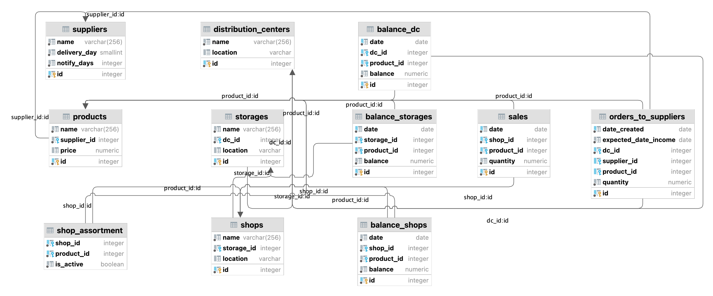

# Business analytics final project: data generation

Generating data and filling the database for the final project on the subject "Business Analytics Systems in Logistics".

### Installing the project

```bash
git clone https://github.com/kovalenkong/business_analytics.git
python3 -m venv venv
source venv/bin/activate
```

### Installing dependencies

```bash
pip install -r requirements.txt
```

### Setup environment variables

Create an `.env` file and fill it with the following variables:

```dotenv
LOGLEVEL=see python logging levels, default: DEBUG
# config for data generation
DATA_DIR=directory in which the generated csv-files will be saved
DATE_FROM=generate data from period, format %Y-%m-%d
DATE_TO=generate data to period, format %Y-%m-%d
N_SUPPLIERS=number of suppliers, default: 20
N_DC=number of distribution centers, default: 3
N_STORAGES=number of storages, default: N_DC*3
N_SHOPS=number of shops, default: N_STORAGES*4
N_PRODUCTS=number of products, default: 100
# database config
PG_HOST=PostgreSQL host
PG_PORT=PostgreSQL port, default: 5432
PG_USER=PostgreSQL user
PG_DB=PostgreSQL database name
PG_PASSWORD=PostgreSQL user password
# optional: location of distribution centers, storages and shops
GEO_DC=list of geopoints without spaces, separeted by ;
GEO_STORAGES=list of geopoints without spaces, separeted by ;
GEO_CENTER=geopoint
# if you use generator/perekrestok package
X5_AUTHORIZATION=Bearer <token>
```

Optional, you can add location to your distribution centers, storages and shops.

The length of `GEO_DC` variable should be equal to `N_DC`.
For example, if `N_DC=3`, then `GEO_DC=55.604131,37.948764;55.596563,37.386148;55.930678,37.340008`

The length of `GEO_STORAGES` variable should be also equal to `N_DC`.
`GEO_STORAGES` has the same format as `GEO_DC`.
Also, if `GEO_STORAGES` is set, then `GEO_DC` must also be set.
The algorithm for calculating the warehouse location point is as follows:
a random point is taken in the square between the DC location point
and the point from the `GEO_STORAGES` variable with the appropriate index is taken

`GEO_CENTER` is written as a point of two coordinates, e.g. `GEO_CENTER=55.754715,37.624805`.

You can find the Bearer token (X5_AUTHORIZATION) by inspecting Fetch/XHR queries
at [perekrestok.ru](https://www.perekrestok.ru/).
You can also define environment variables like this:

```bash
export $PG_HOST=123.456.789.012
```

or define them when you run the command, e.g.:

```bash
PG_HOST=123.456.789.012 PG_PORT=5432 python migrate.py
```

### Generating data

After you have filled out the `.env` file, you can generate the data with the command:

```bash
python generate.py
```

All created csv-files will be saved in the directory specified in the `DATA_DIR` environment variable.

### Applying migrations

```bash
python migrate.py
```

The database schema has the following structure:


